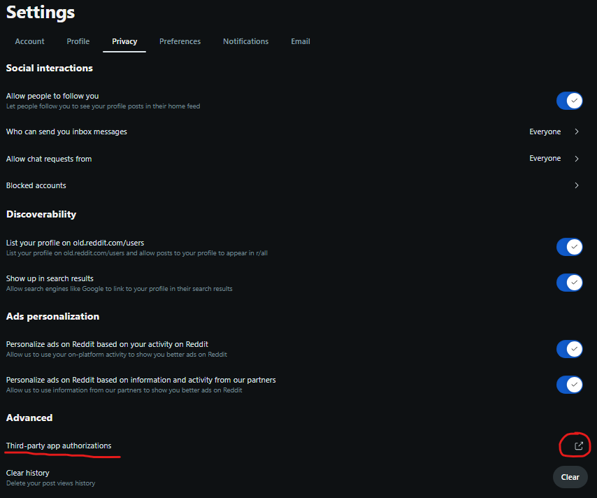
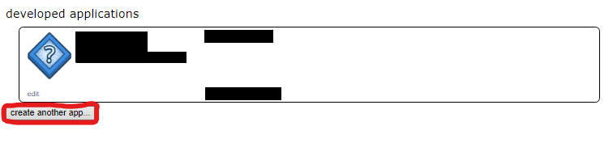
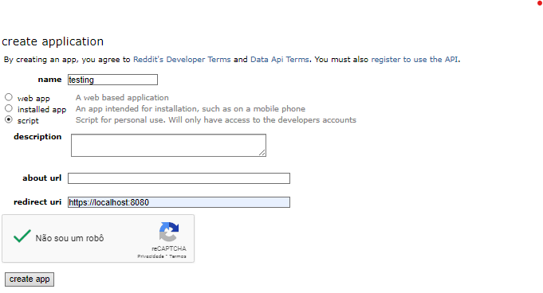
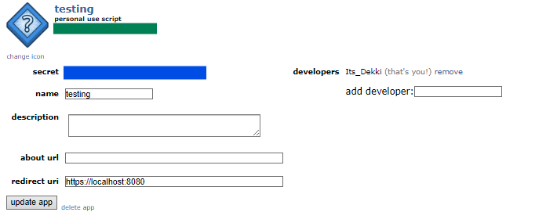

#  Automated Reddit Posting Script 
A quick posting script , to make life easier.

## Motivation:
I'm an artists that usually uses reddit to look for commissioner. A problem that i felt going for reddit is that I had to post in many reddits and garantee everytime the right configurations and also open every subreddit to post in it.


## Features
- Automated posts: Post images and comments to subreddits.
- Posting intervals: Respect the interval of days between posts to avoid spam.
- Multiple image support: Allows you to upload multiple images at the same time.
- NSFW support: Allows you to define whether the post is NSFW (not safe for work).
- Message flair: Adds custom flairs to messages, according to the subreddit configuration.
- Post log: Records the data and time of the last post to control the intervals.

## Prerequisites
Before running the script, you will need to have the following dependencies installed:

- Python 3.7+
- Praw - Library for interacting with the Reddit API.

#### _**If your are running on windows you should be able to just use the executable**._

## How to configure:

### 1. Credential file (config/credetial.json)

This file contains your reddit credentis, so that the script can post in your account.
The credential.json:
```json
{
    "client_id": "Your_Client_Id",
    "client_secret":"Your_Client_Secret",
    "user_agent": "Your_User_Agent",
    "username": "Your_Username",
    "password": "Your_Password"
}
```
#### How to grab your client_id , client_secret and user_agent:
First Step go in to your reddit account and go into privacy and click in _Third-party app_


Click in _create another app.._


When creating another app , name your app and in readirect uri put "https://localhost:8080".


Grab the information where there is the green bar and put in your ```client_id``` , the blue bar you will add in ```client_secret``` and the ```user_agent``` you will add what you named your app.


### 2. Subreddits file (config/subreddits.json)
This file contains the subreddits where the script will post. The posting interval is configured for each subreddit.
example:
```json
{
    "test": {
        "titulo": "Testing automated post",
        "flair_text": "Open",
        "interval_days": 7,
        "nsfw_permitido": false
    },
    "test2": {
        "titulo": "Testing automated post",
        "flair_text": "Open",
        "interval_days": 7,
        "nsfw_permitido": false
    } ...
}
```

There you will add the subreddits that you want to post , following their rules.
That's why you will need to know the correct flair_text for each flair and the correct interval for each posting you do there. _nsfw_permitido_ there you will add **false** if you wanna make a normal post and **true** for nsfw posts

### 3. Content files (config/content.json and images)
This file contains the images and the comment to be posted. The path to the images can be configured, as well as the comment text.
This only works if there is at least 2 images for the posting. examples
```json
{
    "images": [
        "images/FrogRelaxing.jpg",
        "images/AnotherImage.png"
    ],
    "comment": "testing the commentaries"
}
```
Reminder , the images you want to post are recommended to be in the images folder and make sure that the extention for each image is correct
## How to use
Initial setup:

Add your Reddit credentials in the credentials.json file.

Set up the subreddits, title, flairs, and post intervals in the subreddits.json file.

Add the images and commentary in the content.json file.

Execute the main.exe

 or if you are running in terminal:
```bash
 python3 main.py
```